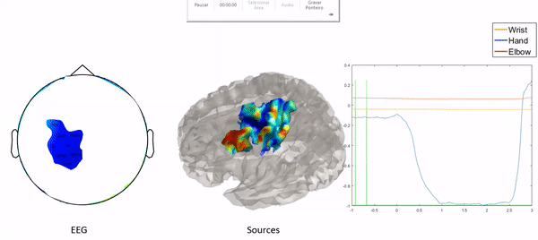

<h1 align="center">
    
</h1>

<h2 align="center">
  Bioprocessing Functions (for EEG and ESI calculations) - BioLab
</h2>

  

  
  
  

  

  

  <a href="#about">About</a>&nbsp;&nbsp;&nbsp;|&nbsp;&nbsp;&nbsp;
  <a href="#main-publication">Publication</a>&nbsp;&nbsp;&nbsp;|&nbsp;&nbsp;&nbsp;
  <a href="#installing-the-application">Installing</a>&nbsp;&nbsp;&nbsp;|&nbsp;&nbsp;&nbsp;
  <a href="#running-the-application">Running</a>&nbsp;&nbsp;&nbsp;|&nbsp;&nbsp;&nbsp;
  <!--<a href="#testing">Testing</a>&nbsp;&nbsp;&nbsp;|&nbsp;&nbsp;&nbsp;-->
  <a href="#built-with">Built with</a>&nbsp;&nbsp;&nbsp;|&nbsp;&nbsp;&nbsp;
  <!--<a href="#layout">Layout</a>&nbsp;&nbsp;&nbsp;|&nbsp;&nbsp;&nbsp;-->
  <a href="#contributing">Contributing</a>&nbsp;&nbsp;&nbsp;|&nbsp;&nbsp;&nbsp;
  <a href="#license">License</a>

 

  

## About

A series of <strong>MATLAB</strong> functions for processing biomedical signals, more specifically for EEG (electroencephalography) and ESI (electromagnetic source imaging) analysis.

There are many functions implemented, from functions for finding signal onset, to functions for pattern recognition and mainly ESI calculation and analysis.

The main purpose of the project was to make the needed calculations necessary for the ESI analysis of upper limb movement related EEG published in <a href="https://repositorio.ufu.br/bitstream/123456789/28620/4/EnhancingEEGSpacial.pdf">Schmiele2019</a> using the data from <a href="https://journals.plos.org/plosone/article?id=10.1371/journal.pone.0182578">Ofner2017</a> and other functions from <a href="http://www.fieldtriptoolbox.org/">FieldTrip</a>.

## Main publication

The following is a brief explanation of the main publication (<a href="https://repositorio.ufu.br/bitstream/123456789/28620/4/EnhancingEEGSpacial.pdf">Schmiele2019</a>) where these functions were applied:

ESI (Electromagnetic Source Imaging) combines EEG and MRI to reconstruct the brain's internal sources. In this study, we investigated the level of information enhancement that ESI grants when analysing different movements from the same upper-limb. We proved ESI's potential for movement control analysis of single upper limb since we reached a spatial resolution enhancement from 24.69 mm to 3.64 mm, were able to analyze spatial and time-frequency information correlated to the performed movements in accordance to the literature.

## Installing the application

In order to fully install the functions simply dowload or branch the repository, then download the contents for the following folders by accessing the link in the file `download.txt` inside each of them:

* <u>Dataset_elbow_wrist_hand</u>: used dataset, originally acquired from <a href="https://journals.plos.org/plosone/article?id=10.1371/journal.pone.0182578">Ofner2017</a>;
* <u>emd</u>: files for Earth Mover's Distance calculation;
* <u>fieldtrip-20190419</u>: <a href="http://www.fieldtriptoolbox.org/">FieldTrip</a> functions used
* <u>Source_Files</u>: generated spatial files (from MRI) for ESI calculation.

## Running the application

Use the following command on your MATLAB console to be able to use every function within bioprocessing_functions: `addpath('<folder_path>\BIOPROCESSING_FUNCTIONS');`.

A list with all main functions can be seen by using the code `bioprocessing_functions();` in your MATLAB console. Additionally, the main information from every function can be accessed by using the standard MATLAB code: `help <function_name>`.

In order to replicate the results from <a href="https://repositorio.ufu.br/bitstream/123456789/28620/4/EnhancingEEGSpacial.pdf">Schmiele2019</a>, simply run the code `organize_data_from_ewh()` in your MATLAB console.

<!--
## Testing

All tests can be run using <strong>supertest</strong> with the following line in terminal: `npm test` 

So far there are two tests:

Back end:
* ong.spec
* generateUniqueId.spec
-->

## Built with

* [MATLAB](https://www.mathworks.com/products/matlab.html)
* [FieldTrip](http://www.fieldtriptoolbox.org/)
* [Ofner2017 Dataset](https://journals.plos.org/plosone/article?id=10.1371/journal.pone.0182578)

<!--
## Layout

 You can download the layout (`.sketch`) using [this link](.github/DevRadar.sketch).

To open it in any SO, use [Figma](https://figma.com).
-->

## Contributing

* Reference the official main publications: <a href="https://repositorio.ufu.br/bitstream/123456789/28620/4/EnhancingEEGSpacial.pdf">Schmiele2019</a> and <a href="https://journals.plos.org/plosone/article?id=10.1371/journal.pone.0182578">Ofner2017</a>
* Fork this repository;
* Create a branch with your feature: `git checkout -b my-feature`;
* Commit your changes: `git commit -m 'feat: My new feature: <description>'`;
* Push it to your branch: `git push origin my-feature`.

After merging your pull request, your branch can be deleted;

## License

This project uses the MIT license. Read [LICENSE](LICENSE.txt) for details.